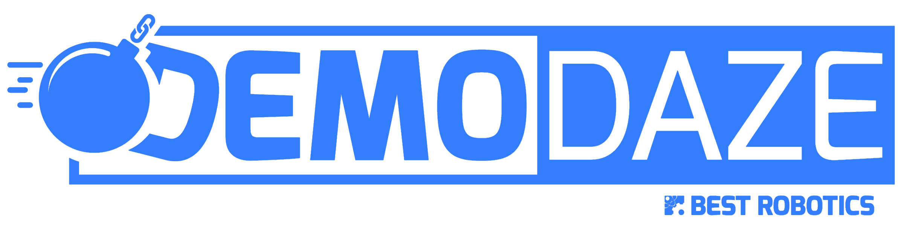

  
   
    
   
  <h1> BEST Team 58 Demo Daze Website Code </h1>
   

This repository contains the website code used for the Demo Daze Competition (2021).
It won the Lockheed Martin Top Website Design at the Texas BEST Competition for UIL Group 2.